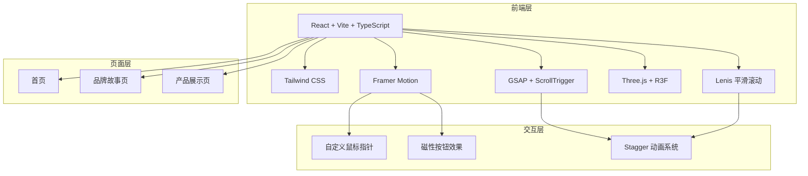
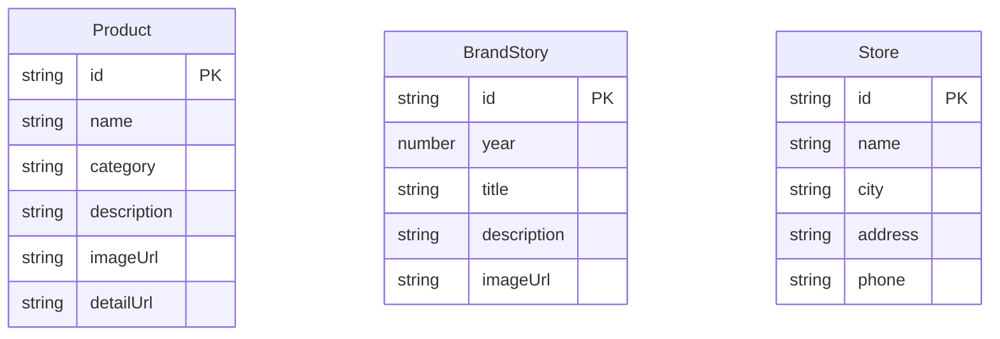

## 1. 架构设计

## 2. 技术说明

- **前端框架**：React@18 + TypeScript + Vite
- **初始化工具**：vite-init (react-ts 模板)
- **样式方案**：Tailwind CSS@3 + CSS Variables（设计令牌）
- **动画库**：Framer Motion@11 + GSAP@3（ScrollTrigger）
- **3D 渲染**：Three.js + @react-three/fiber + @react-three/drei + @react-three/postprocessing
- **平滑滚动**：Lenis（@studio-freight/lenis）
- **路由**：react-router-dom@6
- **状态管理**：zustand
- **图标**：lucide-react
- **后端**：无（纯前端项目）
- **数据**：Mock 数据（JSON 文件）

## 3. 路由定义

| 路由 | 用途 |
|------|------|
| `/` | 首页 — Hero、品牌精神、产品精选 |
| `/story` | 品牌故事页 — 历史时间线、3D 互动 |
| `/collection` | 产品展示页 — 产品网格、详情面板 |

## 4. API 定义

无后端 API，使用本地 Mock 数据。

## 5. 数据模型

### 5.1 数据模型定义

### 5.2 核心组件架构

| 组件 | 职责 |
|------|------|
| `CustomCursor` | 自定义鼠标指针，跟随+悬停变形 |
| `MagneticButton` | 磁性吸附按钮，悬停发光 |
| `SmoothScroll` | Lenis 平滑滚动容器 |
| `StaggerReveal` | 由下至上淡入动画容器 |
| `HeroSection` | 全屏 Hero 区域 |
| `Navbar` | 顶部导航栏 |
| `ProductGrid` | 不规则产品网格 |
| `ProductCard` | 产品卡片（悬停缩放+位移） |
| `BrandSpirit` | 品牌精神区域 |
| `Timeline` | 品牌历史时间线 |
| `Scene3D` | Three.js 3D 场景 |
| `Footer` | 页脚 |
